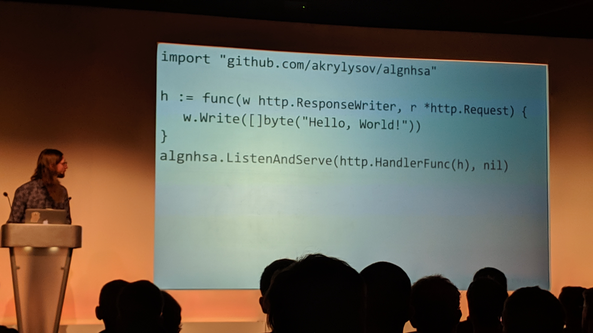
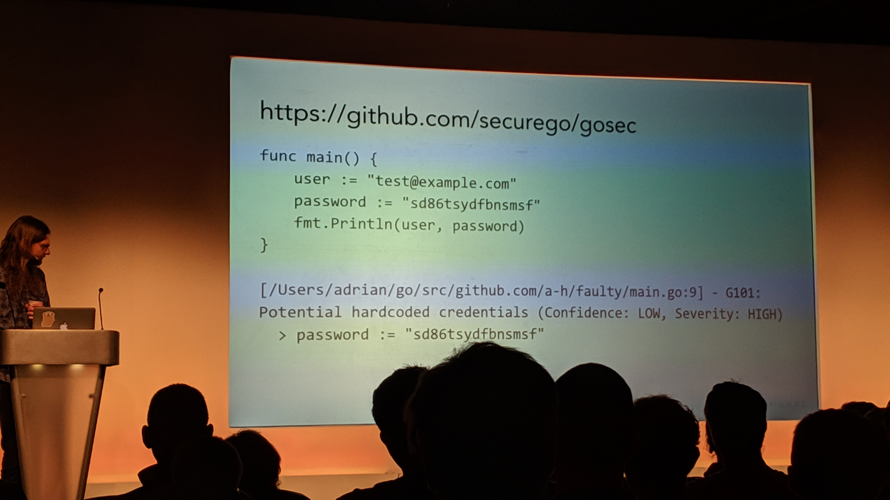
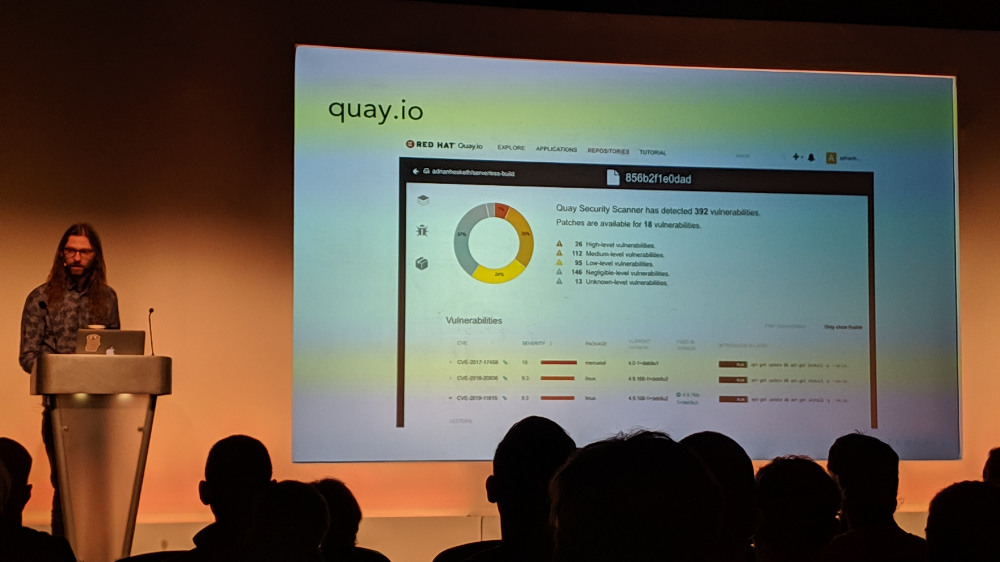
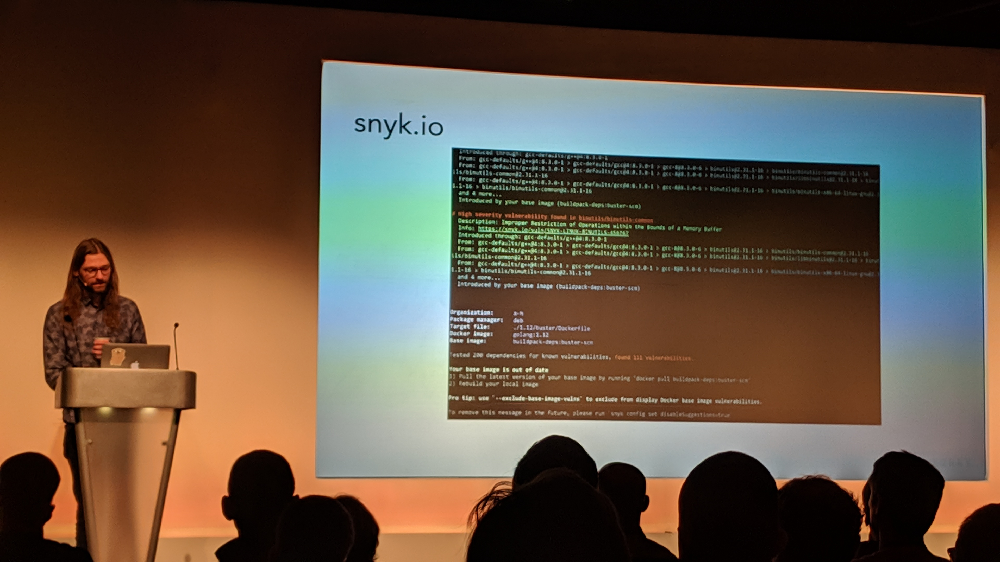
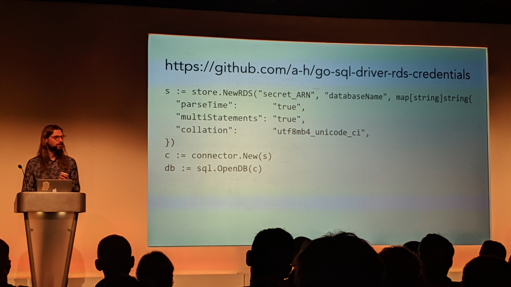
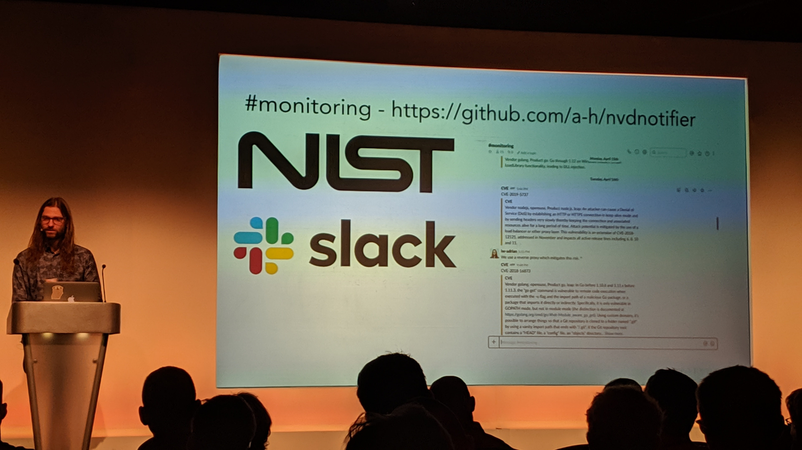
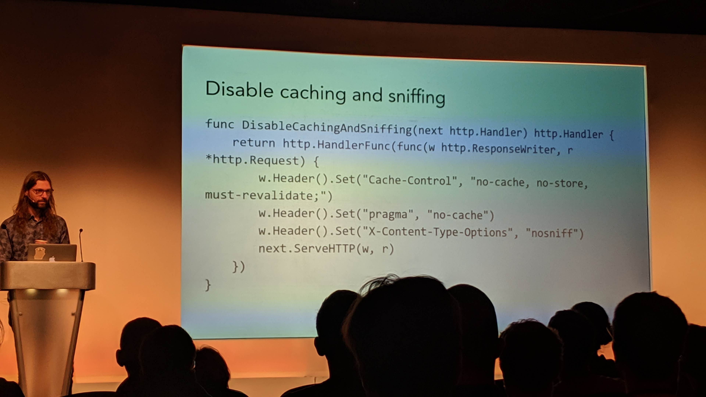
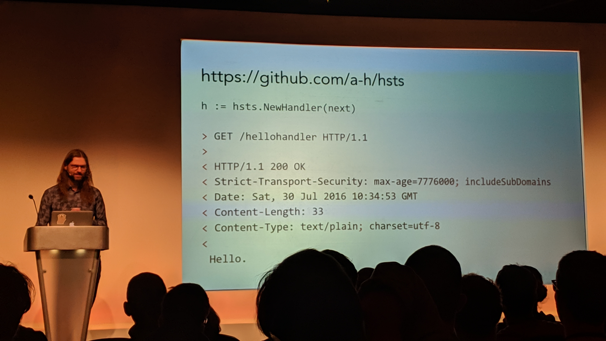

# A Go Security Journey
<!-- .slide: data-background="./gosec.jpg" -->
Adrian Hesketh [@AdrianHesketh](https://twitter.com/AdrianHesketh)

## Intro

This talk was about how to ensure the Go code you create is secure. There were a lot of very interesting tools that Adrian rattled through, which I mostly captured in photographic form!

Adrian also handily supplied a link of links at the end of the talk - <https://gist.github.com/a-h/e5558b35a1e24cc6950406e45ef0d646>

## algnhsa

 <!-- .element: style="max-height: 50%; max-width: 50%" -->

This is a tool that run existing Go web applications on AWS Lambda/API Gateway without changing the existing HTTP handlers.

<https://github.com/akrylysov/algnhsa>

## Golang Security Checker

This tool inspects the source code for security problems, such as hardcoded passwords. Could be added to our CI pipelines.

 <!-- .element: style="max-height: 50%; max-width: 50%" -->

<https://github.com/securego/gosec>

## quay

This tool scans container images for security vulnerabilities.

 <!-- .element: style="max-height: 50%; max-width: 50%" -->

<https://quay.io/>

## snyk

 <!-- .element: style="max-height: 50%; max-width: 50%" -->

This tool scans for dependency security vulnerabilities.

https://snyk.io/

## go-sql-driver-rds-credentials

 <!-- .element: style="max-height: 50%; max-width: 50%" -->

This tool will automatically rotate MySQL credentials when using AWS Secrets Manager.

https://github.com/a-h/go-sql-driver-rds-credentials

## National Vulnerability Database Notifier

 <!-- .element: style="max-height: 50%; max-width: 50%" -->

Notifies on Slack when a new vulnerability is added to the https://nvd.nist.gov database.

https://github.com/a-h/nvdnotifier

## Disable caching and sniffing

 <!-- .element: style="max-height: 50%; max-width: 50%" -->

These are settings that are often missed, that can be disabled for extra security.

https://gist.github.com/a-h/c0d85863621a67e980f7fad44e645fbc

## HTTP Strict Transport Security 

 <!-- .element: style="max-height: 50%; max-width: 50%" -->

This is a tool that redirects users from HTTP to HTTPS and adds the HSTS header.

https://github.com/a-h/hsts

Also consider https://github.com/unrolled/secure

## OWASP Zed Attack Proxy

Free security tool to help automatically find security vulnerabilities in web applications.

https://www.owasp.org/index.php/OWASP_Zed_Attack_Proxy_Project
