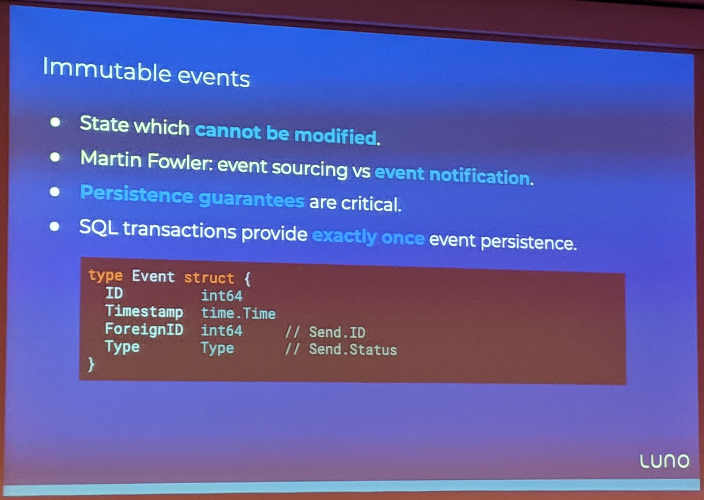
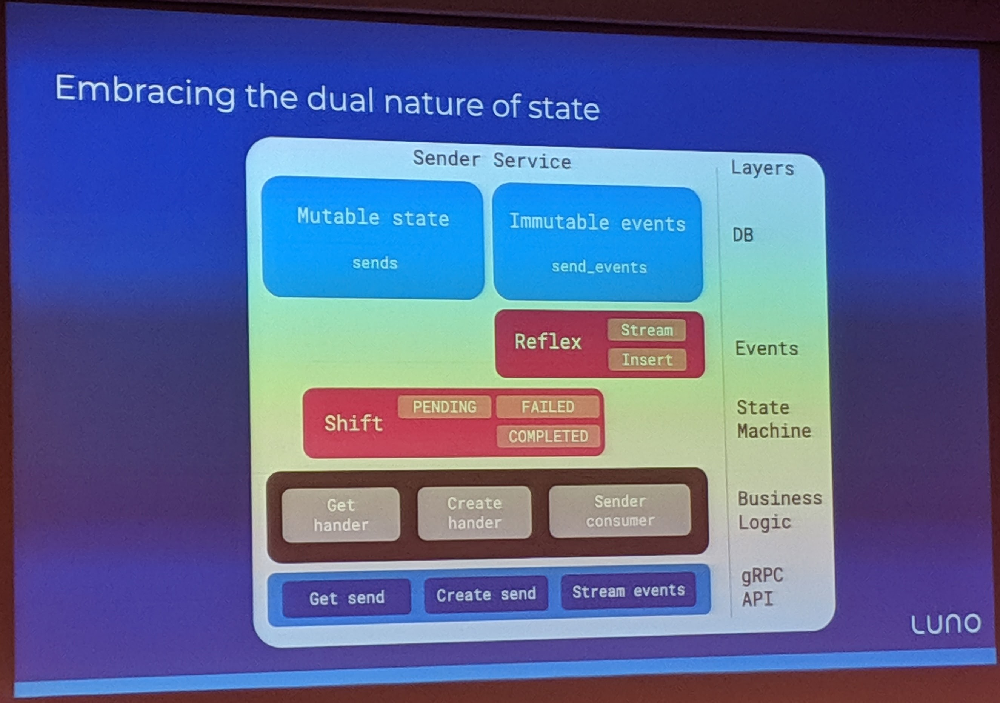
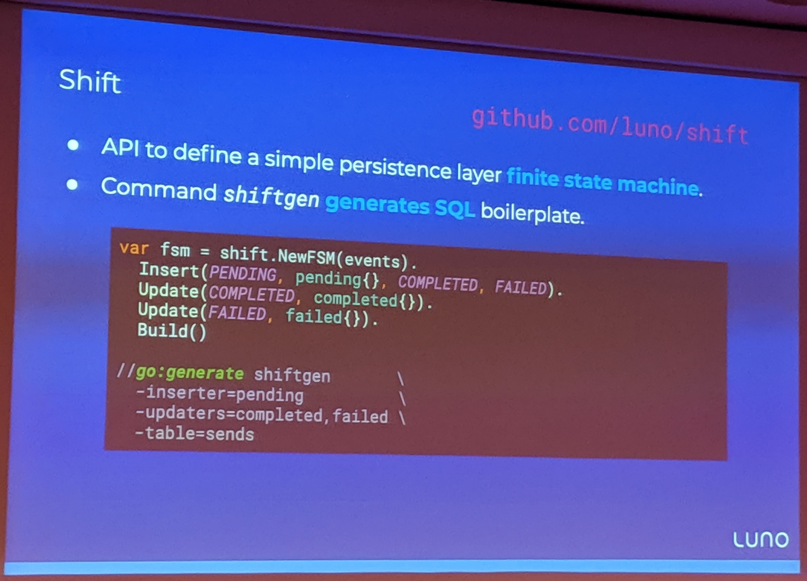
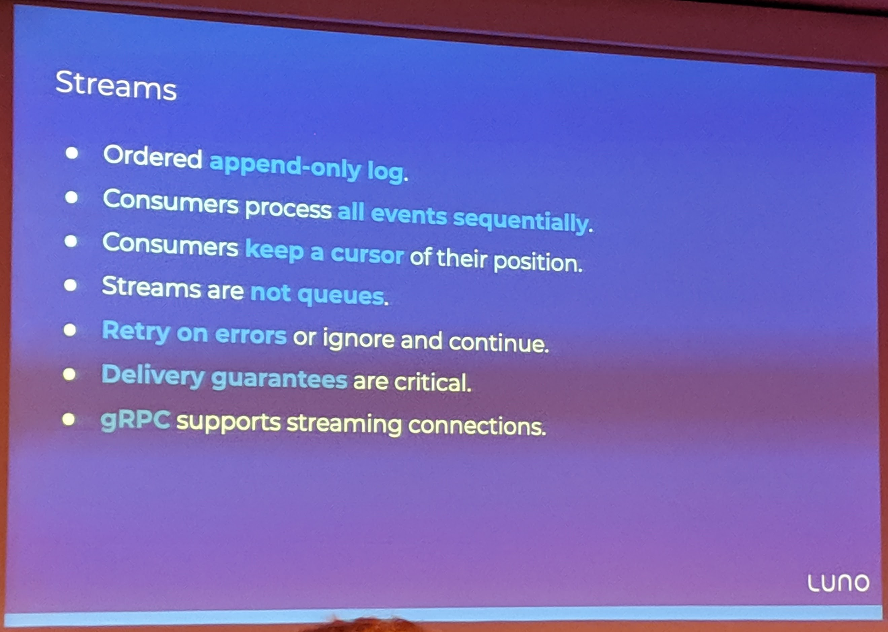
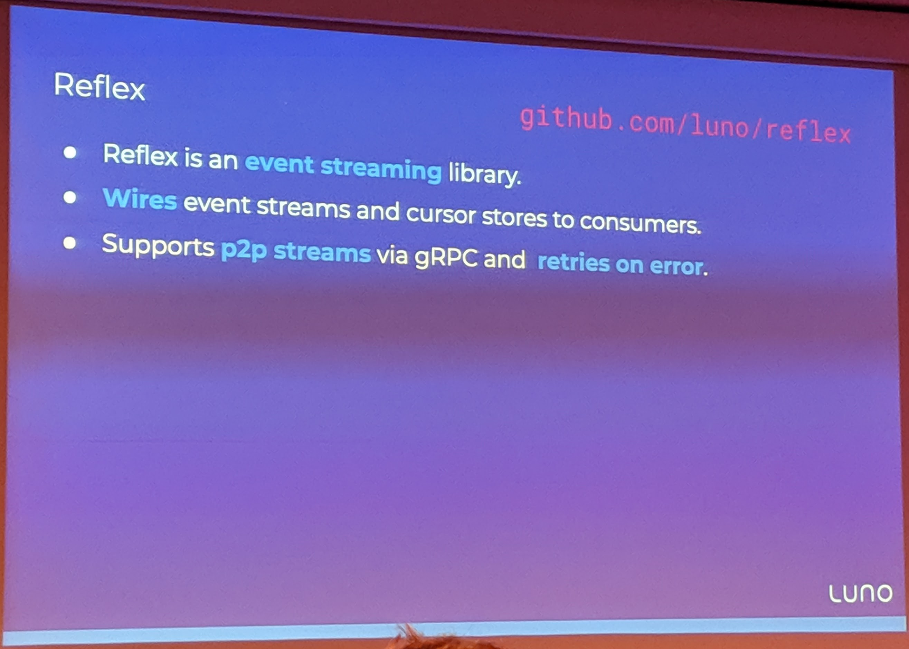
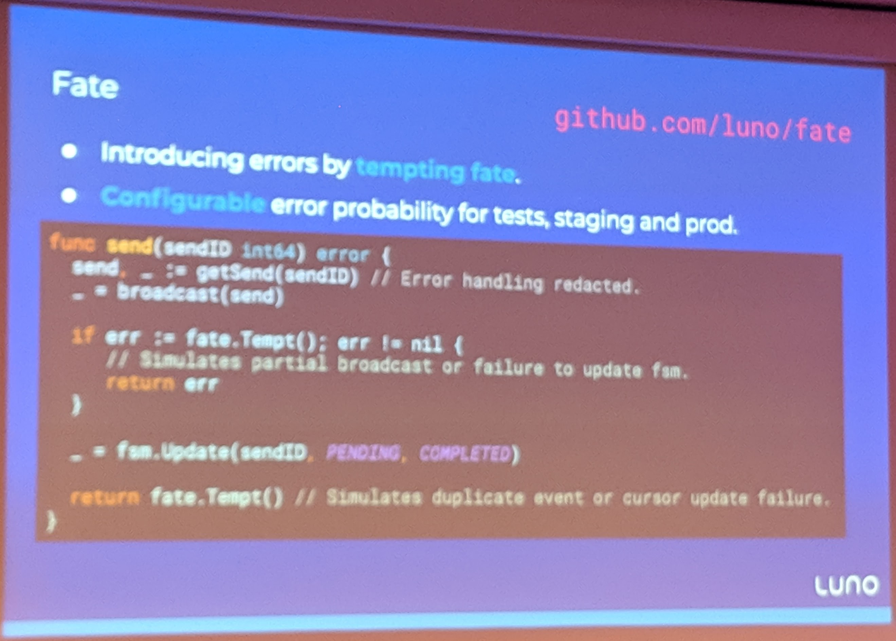

# Dr. Jekyll and Mr. Hyde: Embracing the Dual Nature of State

## Speaker

Corver Roos
LUNO

Corver Roos is a software architect and leader with a strong background in designing, developing and maintaining high performance distributed SaaS platforms. He has an Engineering degree from Stellenbosch University (South Africa) and has worked at multiple leading technology companies in South Africa and in Europe. He is currently a staff software engineer at Luno.

## Intro

You are halfway through processing some business logic in one of your micro services then boom! something fails. This may be due to network issues, or a 3rd party API being down or a deploy of your service. How do you consistently recover from that failure?

This talk explains Luno’s approach to building application logic that is easy to reason about and robust to failures. The following things will be covered:

- Why good old mutable sql tables (where rows are inserted and later updated) are still a great way of storing and representing state.
- How using state machines to control state updates (explicitly defining the life cycle of a row) can help you to understand your business logic.
- When you couple a mutable table with an immutable event table (by inserting an event row for every update in the other table), you maintain a record of every change to your state.
- If you then expose these immutable events as gRPC streams, you provide a way for any microservice to react to a change in any other.
- How ensuring that if your event consumers are idempotent (able to process the same event twice) your business logic becomes robust to most failures.
- And finally, if you then explicitly introduce regular failures in your application logic, you start becoming confident about recovering when an actual failure occurs.

Corver mentioned a lot of interesting Go libraries.

### Shift

Shift provides the SQL persistence layer for a simple "finite state machine" domain model.

https://github.com/luno/shift

### Reflex

Reflex provides an API for building distributed event notification streams.

https://github.com/luno/reflex

### Tempting Fate

This is a great library that allows you to "design for failure"! It allows you introduce random errors into your Go source code, thus testing whether the code can correctly recover from such errors. 

Similar to the Netflix [Chaos Monkey](https://netflix.github.io/chaosmonkey/).

https://github.com/luno/fate