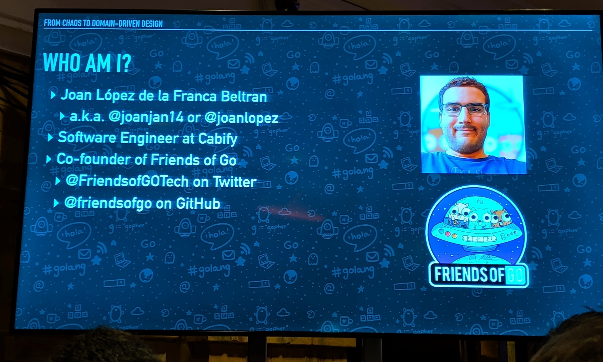
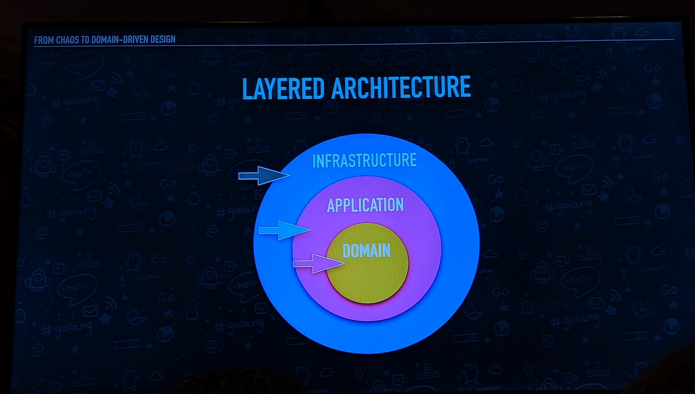
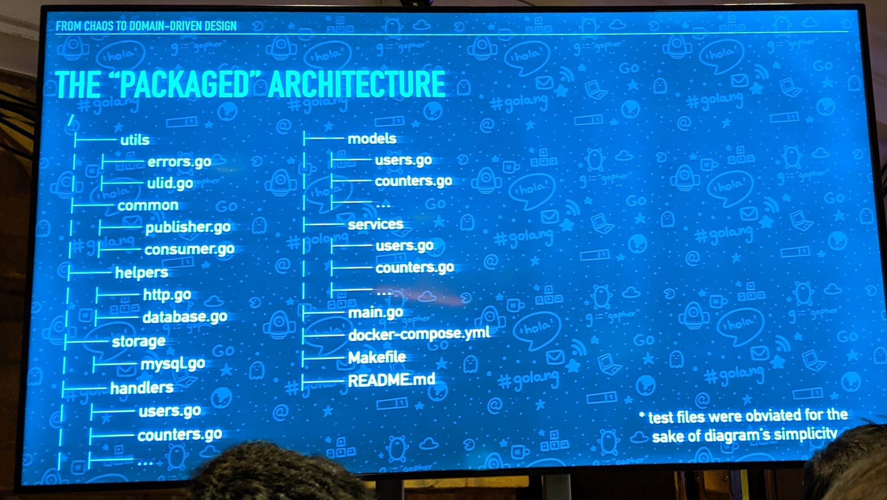
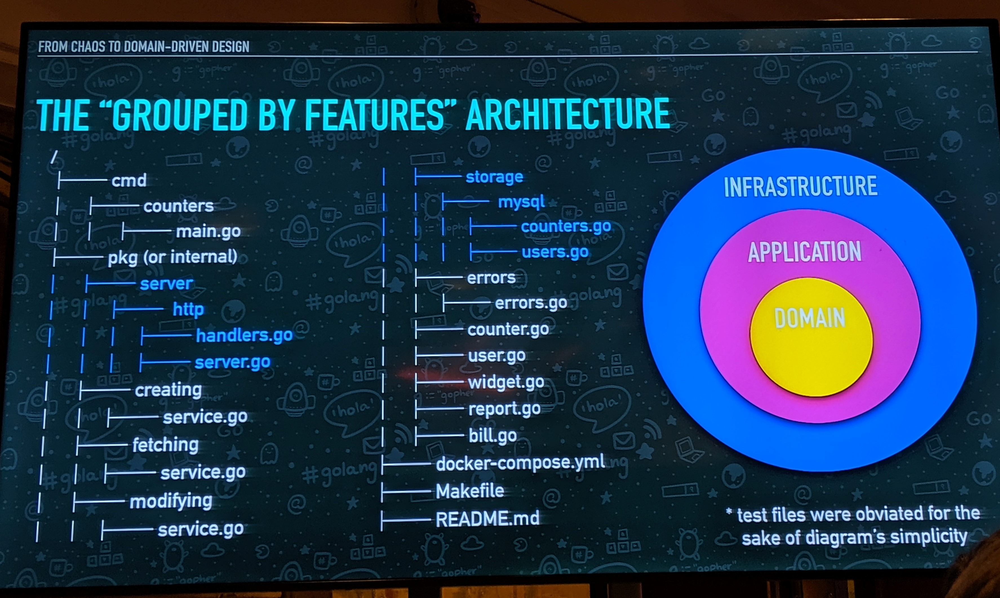

# From Chaos to Domain-Driven Design

## Speaker

Joan López de la Franca Beltran [@joanjan14](https://twitter.com/joanjan14)

## Intro

One of the most common questions that you have, when you are a junior Go developer, is “How can I structure my code to avoid chaos or terryfing cyclical dependencies?”. One of the most common answers in software engineering is around the layered architecture from Domain-Driven Design (DDD) which can help us on how to architecture our code.

The talk will give to people on the room the keys to go from a chaotic Go code to a structured and clean code through DDD’s ins and outs. It won’t be only about DDD but about how to apply DDD-specific concepts in Go.

Both strategical (Layered Architecture, Entities, Value Objects, Aggregates, etc) and tactical (Ubiquitous Language, Bounded Contexts, Shared Kernel) DDD’s points of view will be addressed but making the talk focus on the programming-related concepts.

## Layered Architecture

## Packaged Architecture

## "Grouped By Features" architecture

Uses the repository pattern to retrieve domain objects.

## Resources

- Example of DDD in GoLang
[https://github.com/marcusolsson/goddd)](https://github.com/marcusolsson/goddd)

