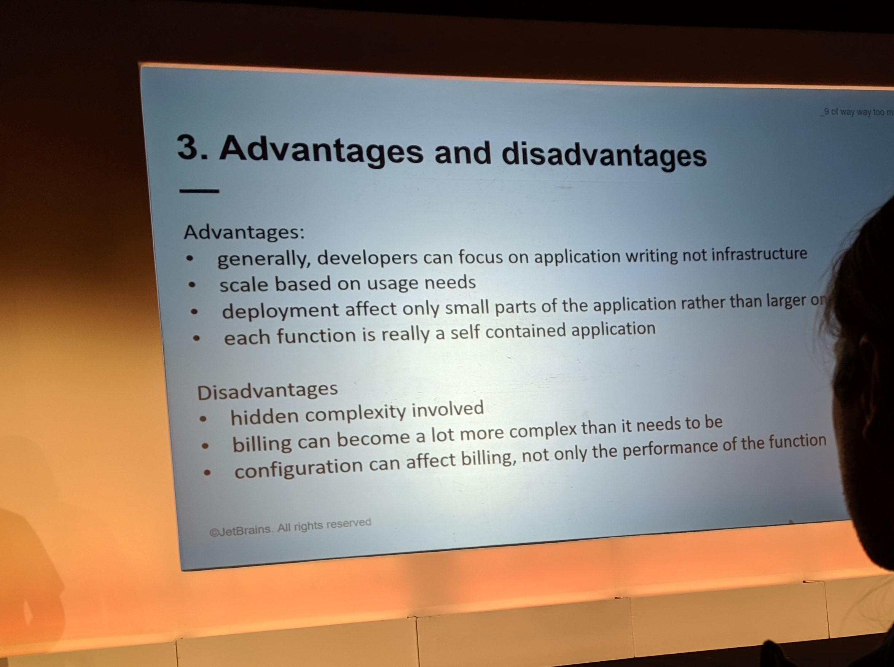

# Going Serverless for Fun & Profit
<!-- .slide: data-background="./up-next.jpg" -->

## Speaker

Florin Pățan [@dlsniper](https://twitter.com/dlsniper)

Florin is a gopher for a few years now, and he built many high-performance, distributed projects. He helps gophers everywhere and works as a Developer Advocate for GoLand IDE at JetBrains. Florin is the former co-organizer of Go London User Group, GDG Berlin Golang, and AWS Berlin User Group.

## Introduction

Notes: This talk looks at what are the options available for a Go developer to work in such environments and showcase going from scratch to a full project in less than 30 minutes. I will quickly explain the serverless concepts, the pros and cons for using it, and show examples of when serverless can be used to make a difference. After that, I will show various platforms for running serverless workloads, such as AWS Lambda or GCP Cloud Functions. With that knowledge, I will then show users how to build such serverless apps so that they can be ready to migrate from a platform to another with little code overhead. One last use-case I’ll present is a possible way to architect their apps for the future, where one could move pieces of logic from standard web servers to serverless infrastructure and vice-versa. If Internet is available (and working), and the Demo Gods are not acting up, this talk will feature live demos, otherwise material will be prepared for off-line scenarios."

## Why Serverless?

What is serverless.. Spinning up/spinning down, you have to plan in advance for unexpected hardware failures, software usage, network failures etc.

Forces us to assume the host is always down.

Don't have to worry about the security to the host, the operating system is already patched, users are provisioned. 

## 1. What is serverless?

## 2. How does it work?

## 3. Advantages and disadvantages

## 4. Use Cases

## Resources

