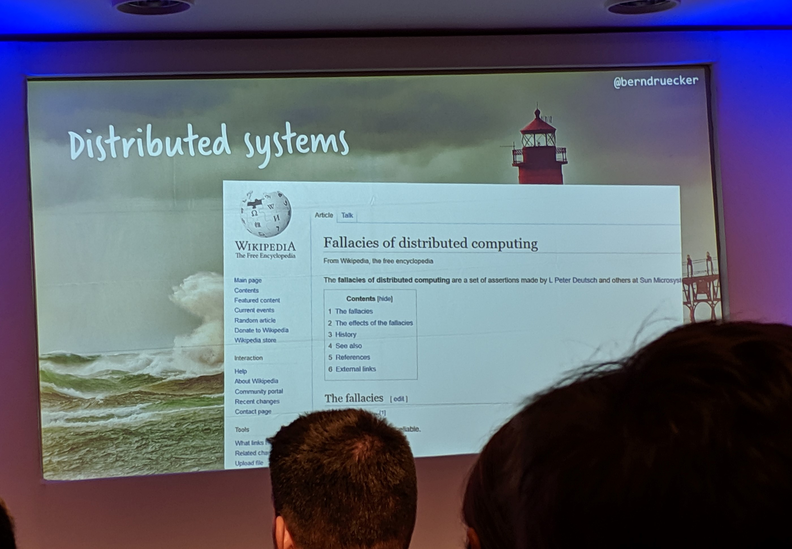
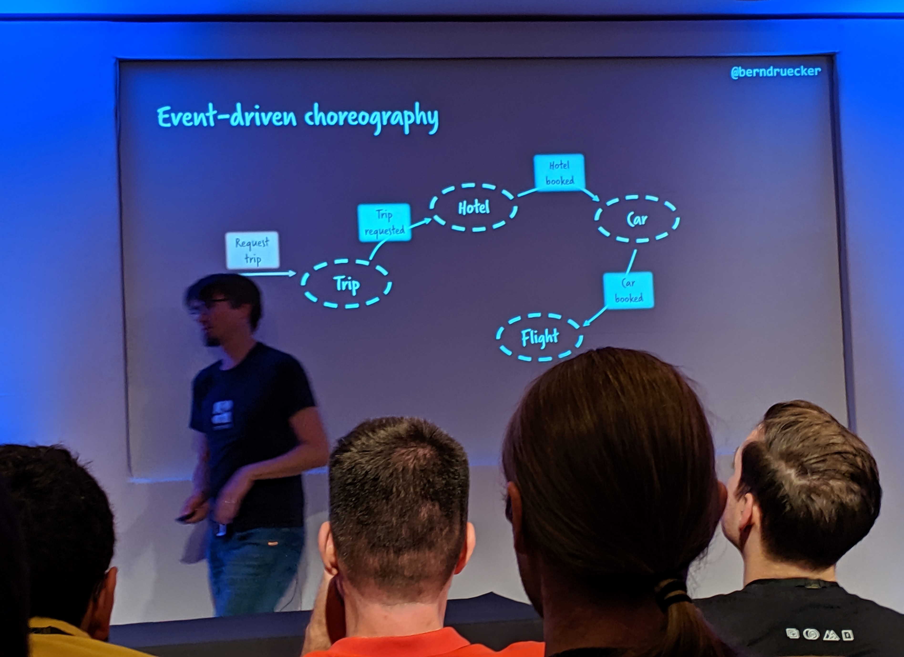
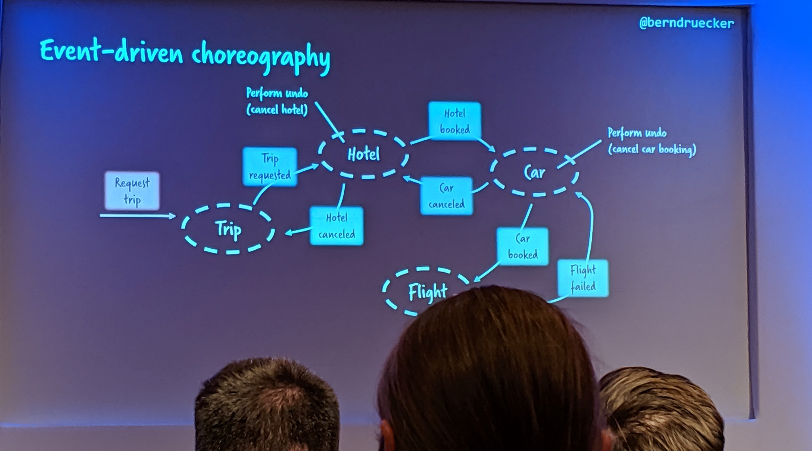
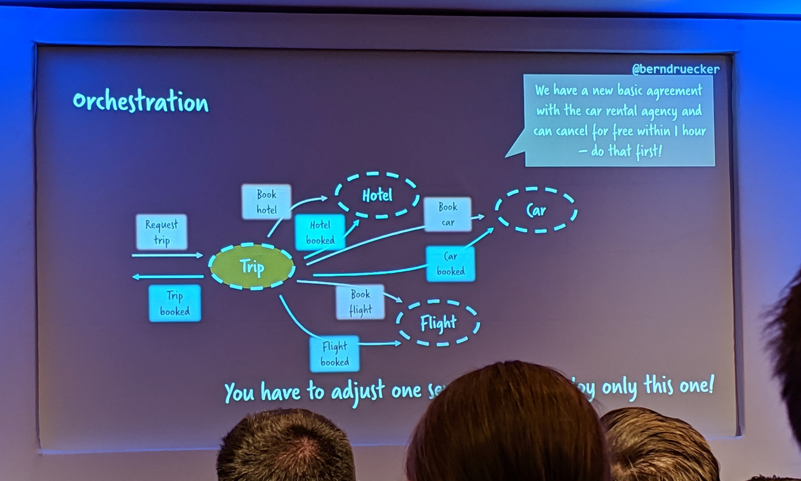

# Lost in Transaction?

Strategies to Manage Consistency in Distributed Systems

## Speaker

Bernd Rücker [@berndruecker](https://twitter.com/berndruecker)
CAMUNDA

## Intro

Consistency gets incredibly hard in today’s architectures as ACID transactions are not available in distributed systems. Most techies are not really aware of the complexity they face. I want to make this transparent but also discuss solution strategies/patterns to survive.

## The fallacies of distributed computing

If you're not aware of them already, you should look it up! 

- The network is reliable
- Latency is zero
- Bandwidth is infinite
- The network is secure
- Topology doesn't change
- There is one administrator
- Transport cost is zero
- The network is homogeneous

## Event driven architecture

The problem with a purely event-only architecture is that not only do you have to listen to *creation* events, but you must also listen to *failure* events to roll-back anything that was previously created, or, alternatively, commit anything which is pending further notifications. This leads to events being tightly coupled to one another and adds latency.

### Before 

Before you take into account ACID principles...

### After

In order to support ACID (consistent) data following an event pattern you need to listen for completion/rejection events also: 

### An alternative?

To improve latency and the consistency of data a pattern emerged...

## The Orchestration (aka Saga) Pattern 

If one of the event's dependencies/rules changes you only have to change the one place (the Orchestrator).

## Contd.

You probably work on a distributed system. Even if you don't yet face a serverless microservice architecture using fancy NoSQL databases, you might simply call some remote services via REST or SOAP. 

This leaves you in charge of dealing with consistency yourself. ACID transactions are only available locally within components and protocols like two-phase commit don’t scale. Many projects either risk adventurous inconsistencies or write a lot of code for consistency management in the application layer. 

In this talk I discuss these problems and go over possible solutions, including the Saga-Pattern. I will discuss recipes and frameworks that ease the management of the right level of consistency. This allows you write business logic code. Expect fun little live hacking sessions with open source components, but also real-life stories.

Uses BMPN workflow diagrams to allow businesses better visibilty of business processes and when workflows are committed.

## Resources

- <https://berndruecker.io/lost-in-transaction/>
- <https://github.com/berndruecker/flowing-retail>
- <https://github.com/berndruecker/flowing-retail/tree/master/zeebe>
- Open source platform for workflow and decision automation - <https://camunda.com/>