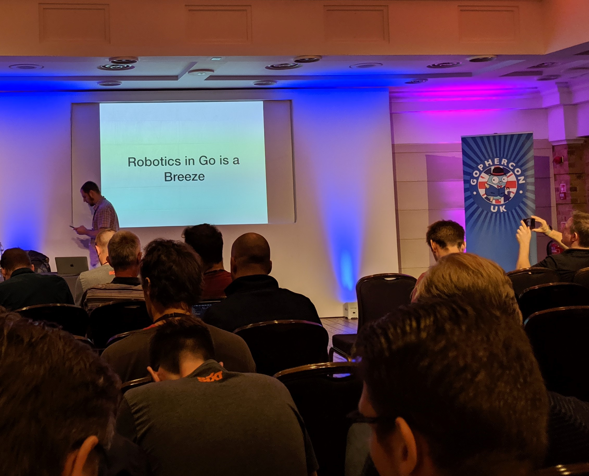
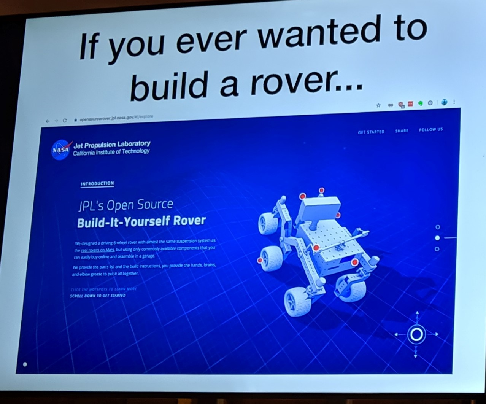
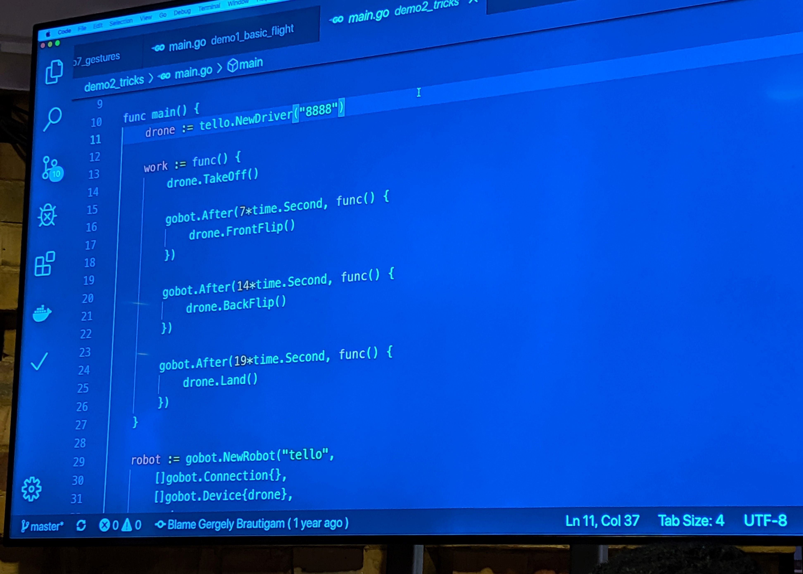
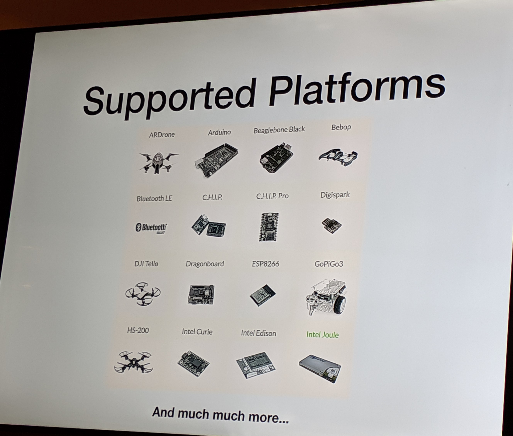

# Robotics with Go is a breeze

## Intro

Ever wanted to control a drone with Go? Of course, who wouldn’t want to do that?! With gobot that’s as easy as goblin pie. Here, let me show you how you can build your own face tracking drone.

## Robotics background

JPL from Nasa open sourced a DIY mars rover. 

The NASA robot contained over 2.5 million lines of custom C code, not just plain C. 

## Enter GoBot

[https://gobot.io/](https://gobot.io/)

Next generation robotics/IoT framework with support for 35 different platforms

### Code 

## Going further

Miniature version of Golang, TinyGo for microcontrollers

Ron Evans, creator of GoCV, GoBot and “technologist for hire” introduced TinyGo that can run directly on microcontrollers like Arduino and more. 

TinyGo uses the LLVM compiler toolchain to create native code that can run directly even on the smallest of computing devices.

### Supported Platforms 

Notes:

Robotics is complex. Traditionally had to know about Microcontrollers, etc. and it was all C code. Go compiles to C code. 
Different to how you would approach backend/frontend development.

The NASA robot contained over 2.5 million lines of custom C code, not just plain C. 

Generally talking about Robotics etc.

Moves in to demonstrating a Drone operated using GoBot - an open source IoT library written in Go for robotics.

The demo showed code on how to follow faces, track hand signals, and flip based on conditions.